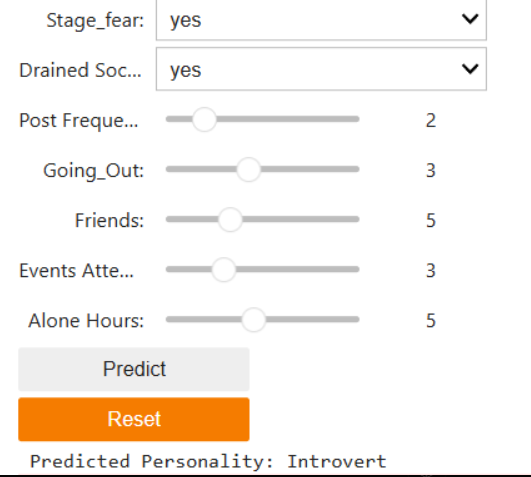

# Personality Prediction using Machine Learning

This project predicts whether a person is an **Introvert** or an **Extrovert** based on their behavioral patterns using a logistic regression model. The solution combines data preprocessing, machine learning, an interactive Jupyter Notebook interface, and Power BI visualizations.

---

## 💡 Key Features

* Data cleaning and preprocessing with Pandas
* Feature engineering and model training using Scikit-learn
* Interactive prediction UI using `ipywidgets`
* Data analysis and visualization using Power BI
* Final project reports in PDF format

---

## 🔧 Technologies Used

* Python (Pandas, NumPy, scikit-learn, ipywidgets)
* Jupyter Notebook
* Power BI (for report creation)

---

## 📁 Project Structure

```
.
├── model train.ipynb                     # Training notebook with data cleaning & model building
├── Personality_prediction.ipynb         # Final UI notebook with interactive predictions
├── personality_dataset_load.ipynb       # Data loading and preparation
├── Cleaned_Personality_Analysis_Report.pdf   # EDA and model insights
├── The power bi report.pdf              # Data visualizations using Power BI
├── requirements.txt                     # List of Python dependencies
├── assets/                              # Images used in README or report
```

---

## 🔬 How to Use

1. Clone this repository or download the files.
2. Open `Personality_prediction.ipynb` in Jupyter Notebook.
3. Run all cells.
4. Use the dropdowns and sliders to input behavior data.
5. Press `Predict` to see the personality prediction.

---

## 📊 Example Input & Output



Input:

* Stage fear: Yes
* Drained after socializing: Yes
* Friends: 5
* Alone Hours: 5

**Output: Introvert**

---

## 📊 Visual Insights


---

## 🌐 Live Preview (Optional)

For a future version, this project can be deployed using Streamlit for live interaction.

---

## 📄 License

MIT License

---

## 🙌 Acknowledgments

This project was built as part of a data science skill development plan.

Feel free to fork and contribute. Feedback is welcome!
